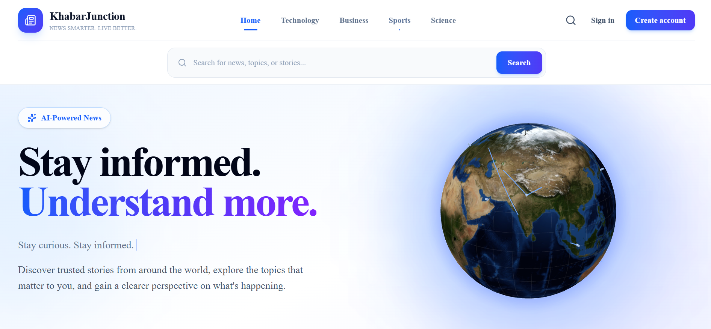
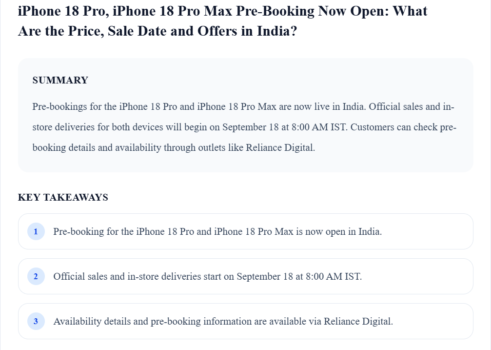

# KhabarJunction

**KhabarJunction** is a full-stack, AI-powered news aggregation platform that enables users to discover, search, personalize, save, and summarize news articles through a unified web application.

The platform integrates external news APIs, user authentication, persistent data storage, and generative AI to provide a personalized and efficient news-reading experience.

## Live Demo

[Visit KhabarJunction](https://khabarjunction.vercel.app)

## GitHub Repository

[View Source Code](https://github.com/ThisisNishank/ai-news-aggregator)

## Features

- **News Aggregation:** Retrieves news articles using the NewsData.io API.
- **News Discovery:** Allows users to explore articles by category and topic.
- **Search Functionality:** Supports keyword-based news search.
- **User Authentication:** Provides registration, login, and session management using Better Auth.
- **Personalized News Feed:** Displays news based on user-selected interests.
- **Saved Articles:** Allows authenticated users to bookmark and manage articles.
- **AI-Powered Summarization:** Uses Google Gemini to generate concise article summaries.
- **Key Takeaways:** Provides three important takeaways for each generated summary.
- **AI Summary Caching:** Stores generated summaries in MongoDB to reduce repeated AI requests.
- **Cache Validation:** Validates cached summaries against article metadata to prevent outdated results.
- **Responsive Interface:** Supports desktop and mobile screen sizes.

## Screenshots

### Homepage



### AI-Powered Article Summary



## Technology Stack

| Category | Technologies |
|---|---|
| Frontend | Next.js, React, TypeScript, Tailwind CSS, Lucide React |
| Backend | Next.js Route Handlers, Node.js, TypeScript |
| Database | MongoDB, Mongoose, MongoDB Atlas |
| Authentication | Better Auth |
| Artificial Intelligence | Google Gemini API, `@google/genai` |
| External API | NewsData.io |
| Deployment | Vercel |
| Version Control | Git, GitHub |

## Application Workflow

```text
User
 |
 v
Next.js Frontend
 |
 v
Next.js Route Handlers
 |
 +--------------------+
 |                    |
 v                    v
NewsData.io       MongoDB Atlas
 |                    |
 v                    |
News Articles     Users, Preferences,
                  Saved Articles,
                  AI Summary Cache
 |
 v
Google Gemini API
 |
 v
Article Summary
and Key Takeaways
 |
 v
Frontend Display
```

## Project Structure

```text
ai-news-aggregator/
├── app/
│   ├── api/
│   ├── login/
│   ├── register/
│   ├── saved/
│   ├── preferences/
│   ├── layout.tsx
│   └── page.tsx
├── components/
├── lib/
├── models/
├── public/
├── screenshots/
│   ├── homepage.png
│   └── ai-summary.png
├── .gitignore
├── next.config.ts
├── package.json
└── tsconfig.json
```

## Getting Started

### Prerequisites

Ensure that the following are installed:

- Node.js 20 or later
- npm
- Git
- MongoDB database
- NewsData.io API key
- Google Gemini API key

### Installation

Clone the repository:

```bash
git clone https://github.com/ThisisNishank/ai-news-aggregator.git
```

Navigate to the project directory:

```bash
cd ai-news-aggregator
```

Install the project dependencies:

```bash
npm install
```

Create a `.env.local` file in the project root and add the following environment variables:

```env
NEWS_DATA_API_KEY=your_newsdata_api_key
MONGODB_URI=your_mongodb_connection_string
BETTER_AUTH_SECRET=your_better_auth_secret
BETTER_AUTH_URL=http://localhost:3000
GEMINI_API_KEY=your_gemini_api_key
```

### Run the Development Server

```bash
npm run dev
```

Open the application in your browser:

[http://localhost:3000](http://localhost:3000)

## Available Scripts

| Command | Description |
|---|---|
| `npm run dev` | Starts the Next.js development server |
| `npm run build` | Creates an optimized production build |
| `npm run start` | Starts the production server |
| `npm run lint` | Runs the linting process |

## Deployment

KhabarJunction is deployed using **Vercel**.

**Live Application:** [https://khabarjunction.vercel.app](https://khabarjunction.vercel.app)

For production deployment, configure the required environment variables in the Vercel project settings.

The production authentication URL should be configured as follows:

```env
BETTER_AUTH_URL=https://khabarjunction.vercel.app
```

## Security

- Sensitive credentials are stored in environment variables.
- `.env.local` is excluded from version control.
- API keys and database credentials are not hardcoded into the source code.
- Authentication-protected features require a valid user session.

## Future Enhancements

- Multi-language article summarization
- Advanced recommendation algorithms
- Duplicate-article detection
- Breaking-news notifications
- Text-to-speech summaries
- Automated unit and integration testing
- Progressive Web App support

## Author

**Nishank Chourey**

Computer Science and Engineering  
Vellore Institute of Technology, Bhopal

### GitHub

[https://github.com/ThisisNishank](https://github.com/ThisisNishank)

### Project Repository

[https://github.com/ThisisNishank/ai-news-aggregator](https://github.com/ThisisNishank/ai-news-aggregator)